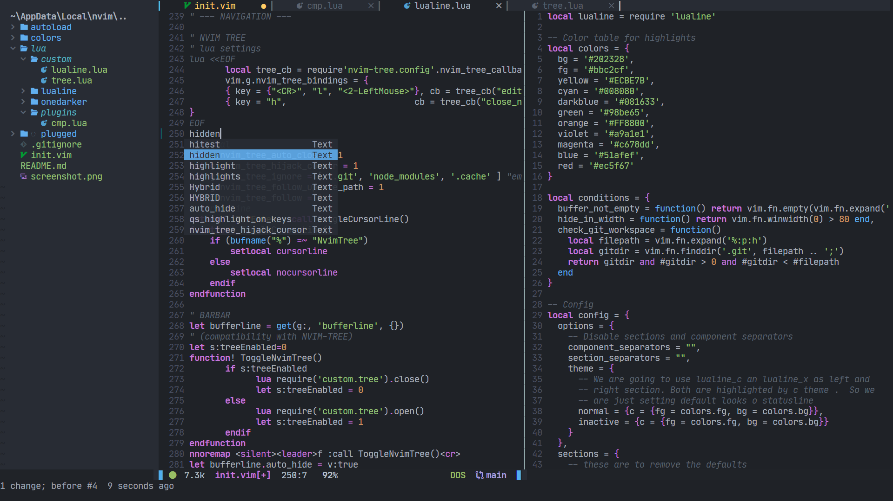

# My nvim config

**NOTE:** If you want to use the `vim-plug` package manager and want a stable and simple repo for windows. After cloning the repo just do...
```
git checkout pkg/plug
```
This will switch the branch to an older version of the repo as you might have seen on my YouTube video.

**It's FAST! (no kidding)**

Quickly setup my exact neovim config without any compromises in a few easy steps.



